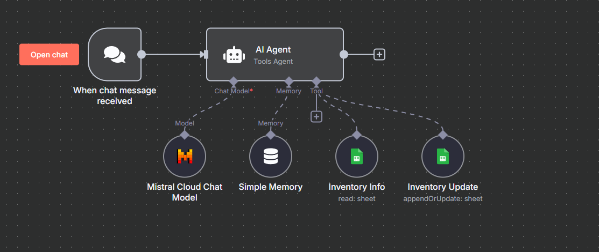

# 🤖 Inventory Chatbot Integration in React

This project demonstrates how to integrate an **n8n Chatbot Agent** into a **React.js** web application using the official `@n8n/chat` package.

## 🚀 Features

- Embedded n8n chatbot in a React app
- Simple and customizable chat widget
- Handles inventory management queries via webhook

## 📦 Tech Stack

- React.js
- JavaScript
- n8n (Low-code automation tool)
- @n8n/chat package

## ⚙️ Workflow



## 🛠️ Setup Instructions

1. **Clone the repository:**

   ```bash
   git clone https://github.com/Kunalpanche/React-n8n.git
   cd react-n8n

2. **Install dependencies::**

   ```bash
   npm install

2. **Run the development server::**

   ```bash
   npm run dev

## 🧠 How It Works

- The React app loads the chat widget on startup.
- All messages are handled by your custom n8n workflow.
- The initial message, logic, and responses are controlled from the n8n backend.

## 📁 File Overview

- `App.jsx` – React component that mounts the chatbot
- `index.jsx` – Main entry point for the React app

